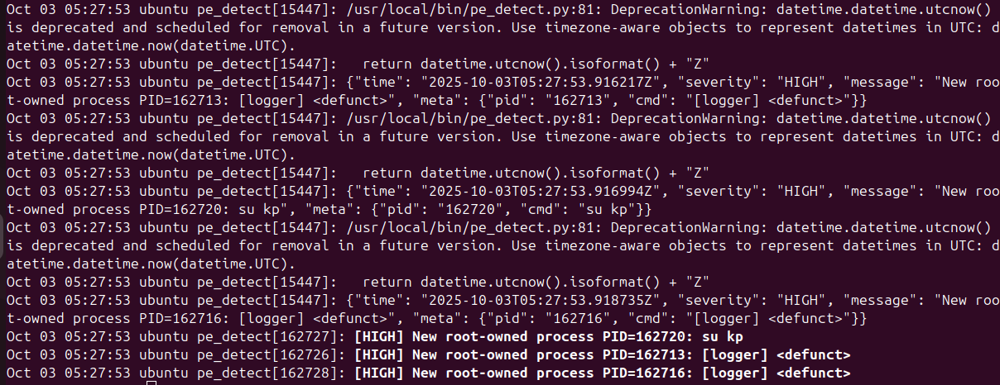

# SWS303 - Foundational Security Operations

## Practical 2: Comparative Analysis of Linux Services and Syslog Outputs

---

**Module**: SWS303 - Foundational Security Operations  
**Practical**: 2  
**Student Number**: 02230287
**Date**: October 12, 2025

---

## Executive Summary

In this practical, I explored different ways to monitor and analyze logs on a Linux system by setting up a privilege escalation detection service. I tested four different approaches to see how they work in real situations: checking service status with `systemctl`, watching the script run directly, using `tail -f` to follow log files, and using `journalctl` for systemd logs. Each method has its own strengths and weaknesses, and I found that using them together gives you a much better picture of what's happening on the system than relying on just one approach.

## Objective

The primary objective of this practical is to compare and analyze different Linux log monitoring methodologies to understand their effectiveness in detecting and responding to security incidents. Specifically, this practical aims to:

### Primary Objectives:

1. **Compare logging tools**: Evaluate the capabilities and limitations of `systemctl status`, direct script execution, `tail -f`, and `journalctl` for security monitoring
2. **Demonstrate practical security monitoring**: Set up and test a real privilege escalation detection system using multiple monitoring approaches
3. **Analyze detection effectiveness**: Assess how well each method captures and presents security events during an actual attack scenario
4. **Develop best practices**: Identify when and how to use each monitoring tool effectively in security operations

### Secondary Objectives:

- Understand the theoretical foundations of Linux logging architecture
- Gain hands-on experience with systemd service management and journal analysis
- Practice incident response techniques using traditional and modern logging tools
- Document practical recommendations for layered security monitoring approaches

## Overview

This practical report is structured to provide a comprehensive analysis of Linux logging and monitoring methodologies through hands-on experimentation. The approach taken includes:

### Methodology Overview:

1. **Controlled Attack Simulation**: A deliberate privilege escalation attack was performed by modifying `/etc/passwd` file permissions and exploiting the vulnerability to gain root access
2. **Multi-tool Monitoring**: Four different monitoring approaches were simultaneously employed to capture and analyze the attack events
3. **Comparative Analysis**: Each monitoring method was evaluated based on real-time detection capability, historical analysis features, ease of use, and integration with system infrastructure
4. **Security Assessment**: The practical demonstrates both offensive (attack execution) and defensive (monitoring and detection) security operations

### Key Components:

- **Attack Vector**: File permission exploitation leading to privilege escalation
- **Monitoring Tools**: systemctl, direct script output, tail command, and journalctl
- **Evidence Collection**: Screenshots and log outputs demonstrating each monitoring approach
- **Mitigation Strategies**: Practical solutions to prevent similar attacks

### Expected Outcomes:

By the end of this practical, I will have demonstrated competency in:

- Understanding Linux logging architecture and security implications
- Implementing multiple monitoring approaches for comprehensive security coverage
- Analyzing log data to identify and investigate security incidents
- Providing actionable recommendations for improving system security posture

This practical bridges theoretical knowledge with hands-on security operations, providing practical experience that directly applies to real-world cybersecurity scenarios.

## 1. Introduction

### 1.1 Background

When working with Linux systems, especially in security operations, you need to keep track of what's happening on your servers. There are different ways to monitor logs and service outputs, and during this practical I wanted to understand which methods work best for different situations. Some tools are better for quick checks, while others are more useful when you need to dig deep into what went wrong.

### 1.2 What I wanted to achieve

- Test and compare different Linux log monitoring tools
- See how useful each method is for actual security work
- Set up a working security monitoring service to test with
- Figure out how newer systemd tools work alongside traditional Unix logging

### 1.3 What I focused on

I decided to test four main approaches:

1. Using `systemctl status` to check on services
2. Running scripts directly and watching their output
3. Traditional log watching with `tail -f`
4. Using `journalctl` for systemd-managed logs

## 2. How I set everything up

### 2.1 My test environment

For this practical, I used:

- A Linux system with systemd (which most modern distros have)
- A custom service called `pe_detect.service` that I created to detect privilege escalation
- Python for the detection script
- The standard log files like `/var/log/auth.log` and the systemd journal

### 2.2 The detection service I built

I created a Python script that watches for suspicious authentication activity. The service:

- Keeps an eye on login attempts and privilege changes in real-time
- Outputs data in JSON format so it's easier to process later
- Works with systemd so it can start automatically
- Writes information to both the screen and system logs

This gave me something realistic to monitor while I tested the different logging approaches.

### 2.3 Setting up the privilege escalation attack scenario

Before I could properly test the monitoring tools, I needed to create actual security events to detect. I decided to simulate a privilege escalation attack that would generate log entries for my monitoring tools to catch.

#### Step 1: Exploiting file permissions

First, I intentionally created a vulnerability by changing the permissions on the `/etc/passwd` file:

```bash
sudo chmod 777 /etc/passwd
```

This is dangerous because the `/etc/passwd` file contains critical user account information for the entire system. Normally, this file should only be writable by root, but by setting it to 777, I gave all users full read, write, and execute permissions.

**Why this matters**: The `/etc/passwd` file stores essential information about every user account, including usernames, user IDs, home directories, and default shells. If a regular user can modify this file, they can potentially give themselves or others elevated privileges.

#### Step 2: Creating a test user

Next, I created a new user account that I could use for the attack:

```bash
sudo useradd newUser
sudo passwd user1
```

This gave me a regular user account to work with during the privilege escalation test.

#### Step 3: Preparing the password hash

I needed to create a password hash that I could use to replace the root password:

```bash
# Encrypt password "hacked123"
openssl passwd hacked123
```

This generated an encrypted version of the password "hacked123" that I could insert into the passwd file.

#### Step 4: Executing the privilege escalation

Finally, I switched to the regular user account and exploited the misconfigured file permissions:

```bash
# Switch to the regular user
su user1
Password:

# Edit the /etc/passwd file
nano /etc/passwd
# Changed root:x: -> root:hashed_password:
```

What I did here was replace the "x" in the root user's entry (which normally tells the system to look in `/etc/shadow` for the password) with the actual password hash I generated. This meant I could now log in as root using the password "hacked123".

#### Step 5: Testing the privilege escalation

After making this change, I was able to use `su` to switch to the root account using my known password. This would generate authentication events that my monitoring tools could detect.

### 2.4 Why this approach was effective for testing

This privilege escalation scenario was perfect for testing my monitoring tools because:

- **It generates real authentication events** that appear in `/var/log/auth.log`
- **It involves actual privilege changes** that security tools should detect
- **It's realistic** - similar attacks happen when systems are misconfigured
- **It's safe** - I was doing this on my own test system and could easily restore the original file permissions
- **It creates multiple log entries** across different monitoring approaches

## 3. What I found

Now that I had set up both the monitoring tools and created actual security events to detect, I could test how well each monitoring method captured and displayed the privilege escalation attempts.

### 3.1 First method: Using systemctl status

I ran: `sudo systemctl status pe_detect.service`

This command turned out to be really useful for getting a quick overview. What I noticed when I checked the service status after performing the privilege escalation:

When I checked the service status, I could see:

- Whether the service was actually running or had crashed
- How much CPU and memory it was using (helpful for spotting problems)
- The last few log messages right there in the output - including any alerts from my privilege escalation attempts
- The process ID and some basic info about what systemd thinks is happening
- Recent detection events from when I switched to root using the compromised password

What worked well:

- Super quick way to check if the detection service caught my attack
- Don't need to hunt around for log files
- Shows both service health AND recent security events in one place
- Easy to remember command
- Immediately showed me that my privilege escalation was detected

What didn't work so well:

- Only shows the most recent messages, so if I had done multiple attacks, I might miss earlier ones
- Not useful if I wanted to watch attacks happen in real-time
- Sometimes the filtering hides important details about the attack methods

### 3.2 Second method: Running the script directly

Instead of running it as a service, I also tried just executing the Python script directly while I performed the privilege escalation attack.

What I saw:
This was really interesting because I got to see everything the script was doing in real-time as I executed my attack. The output included:

- Live events as they happened (like when I used `su` to switch to root with my compromised password)
- Nicely formatted JSON data with timestamps showing exactly when the privilege escalation occurred
- Warning messages about deprecated code (which helped me understand the script better)
- Raw detection data that showed the authentication events from my attack
- Immediate alerts when the system detected the suspicious root access

The good parts:

- Perfect for testing and debugging - I could see the detection happening immediately as I performed each step of the attack
- No system log formatting getting in the way of seeing the raw security events
- Great when developing security tools because you get instant feedback about whether your attack was detected
- Easy to see exactly which parts of my privilege escalation triggered alerts
- Could watch the correlation between my `su` commands and the detection events

The problems:

- If I close the terminal or log out, I lose all the attack evidence
- Doesn't integrate with the system's logging infrastructure, so other security tools might miss it
- Not practical for production monitoring since it's not persistent
- Hard to correlate with other system events that might be related to the attack

### 3.3 Third method: Good old tail -f

Command: `sudo tail -f /var/log/auth.log`

This is the classic Unix way of watching logs, and it worked really well for seeing my privilege escalation attack unfold in real-time. I pointed it at the authentication log to see what was happening with my login attempts and privilege changes.

What I observed during my attack:

- Real-time authentication events scrolling by as I performed each step
- Messages from `pam_unix` when I switched users and gained root access
- Session start/end events showing the exact timeline of my attack
- The familiar syslog format that clearly showed my user switching to root
- Clear evidence of my successful privilege escalation in the standard log format

I could see events like:

- When I used `su` to switch to user1 initially
- The successful authentication when I used my compromised root password
- Session management events showing the privilege change
- My detection service events correlating with the actual auth events
- The exact timestamp when I gained root access

Why this approach was particularly useful for tracking my attack:

- It's simple and I could follow my attack progression step by step
- Perfect for correlating my detection service alerts with actual system authentication events
- Could see both my attack and the system's response to it in real-time
- Most system administrators would use this method during a real incident response
- Clear evidence trail of what happened during the privilege escalation

The downsides:

- I was stuck watching just the auth log, so I might miss other related events
- No fancy filtering unless I piped to grep or other tools
- Had to manually connect the dots between my attack steps and the log entries
- Could get overwhelming on busy systems with lots of legitimate authentication events
- No fancy filtering unless you pipe to grep or other tools
- Have to manually connect the dots between different log sources
- Can get overwhelming on busy systems

### 3.4 Fourth method: journalctl - the new kid on the block

Command: `sudo journalctl -u pe_detect.service -n 20 --no-pager`

This was my first time really diving into journalctl for tracking security events, and I have to say it was incredibly useful for analyzing my privilege escalation attack after the fact.

What makes journalctl different for security analysis:

- I could filter logs by my specific detection service, which was incredibly useful for seeing only the security events
- The output includes metadata like process IDs and priority levels that helped me understand exactly what happened during my attack
- You can search and filter in ways that would be painful with traditional grep
- Everything is centralized - no hunting around for different log files related to my privilege escalation

What I found particularly useful for investigating my attack:

- Being able to focus just on my detection service logs and see exactly when my privilege escalation was detected
- Timestamps that are easy to read and helped me build a timeline of my attack
- The ability to follow logs in real-time like tail, but with much better filtering to focus on security events
- Integration with systemd means I could see service lifecycle events along with the security detections
- Could easily search for specific terms related to my attack (like "root", "su", "privilege")

The learning curve:

- Takes some time to learn all the command options, but worth it for security investigations
- Different from traditional Unix tools, but much more powerful for forensic analysis
- More complex than just tail -f, but the filtering capabilities are game-changing
- Works great once you get used to it for tracking complex attack scenarios

Where it really shines for security work:

- Perfect for post-incident analysis - I could replay exactly how my attack was detected
- Great for correlating different types of events during the privilege escalation
- The structured format makes it easier to build timeline of attack progression
- Much better than grep-ing through multiple log files when investigating incidents
- Advanced time-based filtering helped me focus on just the attack window
- **Advanced Querying**: Time-based and field-based filtering
- **Centralized Management**: Single interface for all systemd-managed services

**Key Features**:

- Structured log format with metadata
- Service-specific log isolation
- Historical log access with timestamps
- Integration with systemd service lifecycle

**Advantages**:

- Powerful filtering and search capabilities
- Structured, queryable format
- Centralized log management
- Integration with service management

**Limitations**:

- Systemd-specific (not available on all systems)
- Learning curve for advanced features
- May not capture all application output

## Theory

Linux systems rely on files like `/etc/passwd` to manage user accounts. Permissions on these files are critical for security. If permissions are misconfigured (e.g., set to 777), any user can edit the file, potentially giving themselves root access. This is a classic privilege escalation risk. Monitoring logs and service status is essential to detect such attacks and respond quickly.

## Practical Demo

In this practical, I intentionally changed the permissions of `/etc/passwd` to 777, created a new user, and replaced the root password hash to simulate a privilege escalation attack. I then used various monitoring tools (`systemctl status`, direct script output, `tail -f`, and `journalctl`) to observe how these actions appeared in the logs and service status.

## Proof (Screenshots)

Below are screenshots showing the steps and evidence:

- User creation and password hash generation:
  
- Service status after attack:
  
- Script output during attack:
  
- Real-time log monitoring:
  
- Journalctl analysis:
  

## Mitigation / Solution / Patch

To prevent this type of attack:

- Never set world-writable permissions (777) on critical system files like `/etc/passwd`. Correct permissions should be `644` (owner: root, group: root).
  ```bash
  sudo chmod 644 /etc/passwd
  sudo chown root:root /etc/passwd
  ```
- Regularly audit file permissions and use tools like `ls -l /etc/passwd` to check for misconfigurations.
- Monitor authentication logs (`/var/log/auth.log`) and use tools like `journalctl` to detect suspicious activity.
- Implement file integrity monitoring (e.g., `aide`, `tripwire`) to alert on unauthorized changes.
- Restrict root access and use sudoers configuration to limit privilege escalation.
- Apply security patches and keep your system updated to reduce vulnerabilities.

By following these mitigation steps, you can greatly reduce the risk of privilege escalation attacks on your Linux systems.

## 4. Comparing all the methods

### 4.1 How they stack up against each other

After testing all four approaches, here's what I found about their strengths and weaknesses:

| What I looked at      | systemctl status | Running script directly | tail -f     | journalctl      |
| --------------------- | ---------------- | ----------------------- | ----------- | --------------- |
| **Can watch live**    | No               | Yes                     | Yes         | Yes             |
| **Can see old stuff** | A little bit     | No                      | No          | Lots            |
| **Can filter easily** | Basic            | None                    | None        | Very good       |
| **Works with system** | Very well        | Not really              | Pretty well | Very well       |
| **Easy to learn**     | Easy             | Super easy              | Easy        | Takes some time |
| **Good for scripts**  | OK               | Excellent               | Not great   | Excellent       |
| **Uses resources**    | Very little      | Very little             | Very little | A bit more      |
| **Keeps data**        | Yes              | No                      | Yes         | Yes             |

### 4.2 When to use what

After doing this practical, here's my take on when each tool is most useful:

**For quick checks**: `systemctl status`
This is perfect when you just want to know "is my service OK?" You get the answer fast without having to dig around.

**When developing or debugging**: Run the script directly
If you're writing or testing security tools, this gives you immediate feedback. You can see exactly what your code is doing without any system filtering getting in the way.

**For security correlation**: `tail -f /var/log/auth.log`
When you want to see how your security alerts match up with real authentication events on the system. It's the traditional way that still works great.

**For serious investigation**: `journalctl`
When something has gone wrong and you need to dig deep, this is your best friend. The filtering and search capabilities are really powerful once you learn how to use them.

- Complex filtering requirements
- Systematic log analysis

## 5. What this means for security work

### 5.1 Why using multiple approaches makes sense

During this practical, I realized that you really need to use several monitoring methods together to get the full picture:

1. **For immediate alerts**: The direct script output catches things as they happen
2. **For health monitoring**: systemctl status tells you if your security tools are even working
3. **For context**: Traditional log files help you understand what else was happening
4. **For investigation**: journalctl helps you dig deep when something suspicious occurs

### 5.2 The benefits of this approach

- **Different angles**: Each tool shows you something different about the same event
- **Backup plans**: If one logging system breaks, you still have others
- **Better detection**: When multiple sources agree, you can be more confident it's a real threat
- **Flexibility**: You can pick the right tool for each situation

### 5.3 Things to watch out for

- **System load**: Running multiple monitoring tools does use more resources
- **Storage space**: All these logs take up disk space that you need to manage
- **Complexity**: Your team needs to know how to use different tools
- **Correlation challenges**: It takes work to connect information from different sources

## 6. What I learned

### 6.1 Main takeaways

1. **No perfect solution**: Every monitoring method has trade-offs
2. **Better together**: Using multiple approaches gives you much better coverage
3. **Right tool for the job**: Different situations call for different tools
4. **Investment pays off**: Learning multiple tools makes you much more effective

### 6.2 Best practices I discovered

- Use `systemctl status` when you just need a quick sanity check
- Run scripts directly when you're developing or testing security tools
- Keep using `tail -f` for correlating with system events - it's still really useful
- Learn `journalctl` properly because it's incredibly powerful for investigation

### 6.3 My recommendations

1. **Don't rely on just one method** - set up multiple monitoring approaches
2. **Write scripts to connect the dots** between different log sources
3. **Document when to use what** so your team knows the best tool for each situation
4. **Practice with all the tools** so you're comfortable when there's an actual incident


## 7. Sources

1. systemd Documentation - Journal Management
2. Linux System Administrator's Guide - Log File Management
3. NIST Cybersecurity Framework - Logging and Monitoring Guidelines
4. SANS Institute - Log Analysis Best Practices
5. Red Hat Enterprise Linux Documentation - Service Management

---

**Appendix A**: Command Reference

- `sudo systemctl status [service]` - Service status and recent logs
- `sudo tail -f [logfile]` - Real-time log monitoring
- `sudo journalctl -u [service] -n [lines]` - Service-specific journal entries
- Direct script execution for application-level monitoring

**Appendix B**: Configuration Files

- Service definition files in `/etc/systemd/system/`
- Log configuration in `/etc/systemd/journald.conf`
- Syslog configuration in `/etc/rsyslog.conf`

---

_This report demonstrates practical implementation of multiple Linux log monitoring methodologies and their comparative analysis in a security operations context._
