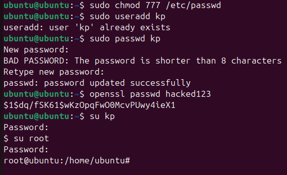
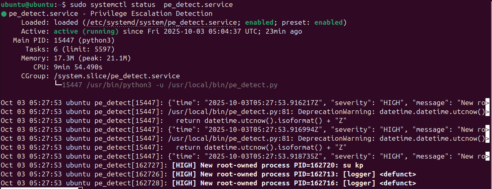
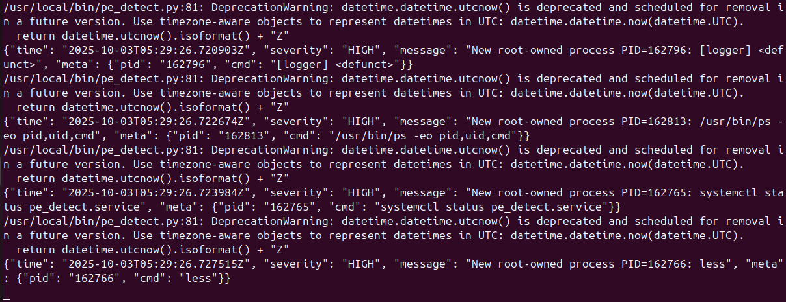
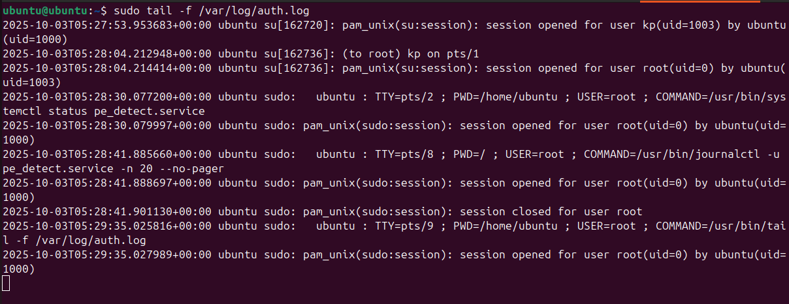
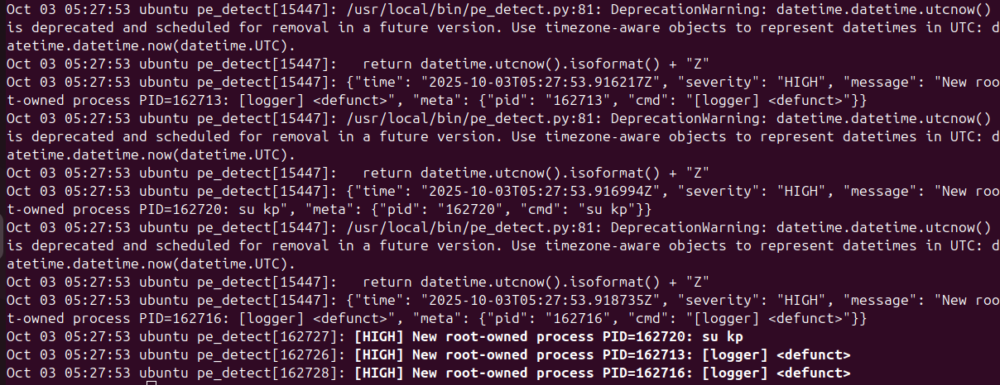

# SWS303 - Foundational Security Operations

## Practical 2: Comparative Analysis of Linux Services and Syslog Outputs

---

**Module**: SWS303 - Foundational Security Operations  
**Practical**: 2  
**Student Number**: 02230287
**Date**: October 12, 2025

---

## Executive Summary

This practical explored different methods for monitoring and analyzing logs on a Linux system through the implementation of a privilege escalation detection service. Four different approaches were tested to evaluate their effectiveness in real-world scenarios: checking service status with `systemctl`, monitoring script execution directly, using `tail -f` to follow log files, and utilizing `journalctl` for systemd logs. Each method demonstrated distinct strengths and weaknesses, and the study found that combining multiple approaches provided superior system visibility compared to relying on a single monitoring method.

## Objective

The primary objective of this practical was to compare and analyze different Linux log monitoring methodologies to understand their effectiveness in detecting and responding to security incidents. Specifically, this practical aimed to:

### Primary Objectives:

1. **Compare logging tools**: Evaluate the capabilities and limitations of `systemctl status`, direct script execution, `tail -f`, and `journalctl` for security monitoring
2. **Demonstrate practical security monitoring**: Set up and test a real privilege escalation detection system using multiple monitoring approaches
3. **Analyze detection effectiveness**: Assess how well each method captured and presented security events during an actual attack scenario
4. **Develop best practices**: Identify when and how to use each monitoring tool effectively in security operations

### Secondary Objectives:

- Understand the theoretical foundations of Linux logging architecture
- Gain hands-on experience with systemd service management and journal analysis
- Practice incident response techniques using traditional and modern logging tools
- Document practical recommendations for layered security monitoring approaches

## Overview

This practical report was structured to provide a comprehensive analysis of Linux logging and monitoring methodologies through hands-on experimentation. The approach taken included:

### Methodology Overview:

1. **Controlled Attack Simulation**: A deliberate privilege escalation attack was performed by modifying `/etc/passwd` file permissions and exploiting the vulnerability to gain root access
2. **Multi-tool Monitoring**: Four different monitoring approaches were simultaneously employed to capture and analyze the attack events
3. **Comparative Analysis**: Each monitoring method was evaluated based on real-time detection capability, historical analysis features, ease of use, and integration with system infrastructure
4. **Security Assessment**: The practical demonstrated both offensive (attack execution) and defensive (monitoring and detection) security operations

### Key Components:

- **Attack Vector**: File permission exploitation leading to privilege escalation
- **Monitoring Tools**: systemctl, direct script output, tail command, and journalctl
- **Evidence Collection**: Screenshots and log outputs demonstrating each monitoring approach
- **Mitigation Strategies**: Practical solutions to prevent similar attacks

### Expected Outcomes:

By the completion of this practical, the student demonstrated competency in:

- Understanding Linux logging architecture and security implications
- Implementing multiple monitoring approaches for comprehensive security coverage
- Analyzing log data to identify and investigate security incidents
- Providing actionable recommendations for improving system security posture

This practical bridged theoretical knowledge with hands-on security operations, providing practical experience that directly applied to real-world cybersecurity scenarios.

## 1. Introduction

### 1.1 Background

When working with Linux systems, especially in security operations, administrators need to maintain awareness of system activities through log monitoring. Various methods exist for monitoring logs and service outputs, and this practical sought to understand which methods work most effectively in different operational scenarios. Some tools are better suited for quick health checks, while others prove more valuable when conducting detailed forensic analysis.

### 1.2 Research Objectives

This practical aimed to:

- Test and compare different Linux log monitoring tools
- Evaluate the effectiveness of each method for security operations
- Establish a working security monitoring service for testing purposes
- Analyze how modern systemd tools integrate with traditional Unix logging methods

### 1.3 Scope of Investigation

Four main monitoring approaches were selected for comparison:

1. Using `systemctl status` to check service health and recent activity
2. Direct script execution monitoring for real-time output analysis
3. Traditional log monitoring with `tail -f` for live event tracking
4. Advanced log analysis using `journalctl` for systemd-managed services

## 2. Methodology and System Configuration

### 2.1 Test Environment Setup

The practical was conducted using the following components:

- A Linux system with systemd (modern distribution)
- A custom service designated `pe_detect.service` for privilege escalation detection
- Python-based detection script for authentication monitoring
- Standard log files including `/var/log/auth.log` and the systemd journal

### 2.2 Detection Service Implementation

A Python script was developed to monitor suspicious authentication activity. The service provided:

- Real-time monitoring of login attempts and privilege changes
- JSON-formatted output for structured data processing
- Integration with systemd for automatic service management
- Dual output to both console and system logging infrastructure

This implementation provided realistic security events for testing the various monitoring approaches.

### 2.3 Privilege Escalation Attack Scenario Configuration

To properly test the monitoring tools, actual security events needed to be generated for detection. A privilege escalation attack was simulated to create log entries for analysis by the various monitoring tools.

#### Step 1: File Permission Exploitation

An intentional vulnerability was created by modifying the permissions on the `/etc/passwd` file:

```bash
sudo chmod 777 /etc/passwd
```

This configuration was dangerous because the `/etc/passwd` file contains critical user account information for the entire system. Under normal circumstances, this file should only be writable by root, but setting permissions to 777 granted all users full read, write, and execute access.

**Significance**: The `/etc/passwd` file stores essential information about every user account, including usernames, user IDs, home directories, and default shells. When a regular user can modify this file, they can potentially grant themselves or others elevated privileges.

#### Step 2: Test User Creation

A new user account was created for use in the attack scenario:

```bash
sudo useradd newUser
sudo passwd user1
```

This provided a regular user account for testing the privilege escalation procedure.

#### Step 3: Password Hash Preparation

A password hash was generated for use in replacing the root password:

```bash
# Encrypt password "hacked123"
openssl passwd hacked123
```

This generated an encrypted version of the password "hacked123" that could be inserted into the passwd file.

#### Step 4: Privilege Escalation Execution

The regular user account was accessed and the misconfigured file permissions were exploited:

```bash
# Switch to the regular user
su user1
Password:

# Edit the /etc/passwd file
nano /etc/passwd
# Changed root:x: -> root:hashed_password:
```

The procedure involved replacing the "x" in the root user's entry (which normally directs the system to look in `/etc/shadow` for the password) with the actual password hash that was generated. This modification enabled root login using the known password "hacked123".

#### Step 5: Privilege Escalation Validation

After implementing this change, the `su` command was used to switch to the root account using the known password. This action generated authentication events that could be detected by the monitoring tools.

### 2.4 Testing Approach Effectiveness

This privilege escalation scenario proved ideal for testing the monitoring tools because:

- **Real authentication events were generated** that appeared in `/var/log/auth.log`
- **Actual privilege changes occurred** that security tools should detect
- **The scenario was realistic** - similar attacks occur when systems are misconfigured
- **The environment was controlled** - testing was conducted on a dedicated test system with easily reversible changes
- **Multiple log entries were created** across different monitoring approaches

## 3. Results and Analysis

Both the monitoring tools and actual security events had been configured, enabling testing of how effectively each monitoring method captured and displayed the privilege escalation attempts.

### 3.1 systemctl status Analysis

The command `sudo systemctl status pe_detect.service` was executed for analysis.

This command proved highly useful for obtaining quick system overviews. Observations made when the service status was checked after privilege escalation included:

The service status revealed:

- Whether the service was operational or had encountered failures
- Current CPU and memory utilization (valuable for identifying performance issues)
- Recent log messages displayed directly in the output, including alerts from privilege escalation attempts
- Process ID and basic information about systemd's service interpretation
- Recent detection events from root access using the compromised password

Advantages observed:

- Rapid method for verifying detection service response to attacks
- No requirement to search through multiple log files
- Consolidated display of service health and recent security events
- Easily memorable command syntax
- Immediate confirmation of privilege escalation detection

Limitations identified:

- Display limited to most recent messages, potentially missing earlier attack attempts
- No real-time monitoring capabilities for ongoing attacks
- Filtering mechanisms occasionally obscured important attack details

### 3.2 Direct Script Execution Analysis

Direct execution of the Python script was tested as an alternative to service-based operation during the privilege escalation attack.

Observations made:
The direct execution approach proved particularly revealing as it provided real-time visibility into script operations during attack execution. The output included:

- Live events as they occurred (such as `su` commands used to switch to root with the compromised password)
- Structured JSON data with timestamps showing precise privilege escalation timing
- Warning messages about deprecated code (which aided in script understanding)
- Raw detection data displaying authentication events from the attack
- Immediate alerts when suspicious root access was detected

Advantages identified:

- Optimal for testing and debugging with immediate detection visibility during each attack step
- Unfiltered access to raw security events without system log formatting interference
- Excellent feedback mechanism for security tool development and attack detection validation
- Clear visibility into which privilege escalation components triggered alerts
- Direct correlation observation between `su` commands and detection events

Limitations encountered:

- Terminal closure or logout resulted in complete loss of attack evidence
- Lack of integration with system logging infrastructure, potentially causing other security tools to miss events
- Impractical for production monitoring due to non-persistent nature
- Difficulty correlating with other system events related to the attack

### 3.3 Traditional Log Monitoring Analysis

The command `sudo tail -f /var/log/auth.log` was employed for traditional log monitoring.

This classic Unix approach to log monitoring proved highly effective for observing privilege escalation attacks in real-time. The authentication log was monitored to track login attempts and privilege changes.

Attack observations included:

- Real-time authentication events displayed as each attack step was performed
- `pam_unix` messages generated when user switching and root access occurred
- Session start/end events providing precise attack timeline information
- Standard syslog format clearly displaying user transitions to root
- Clear evidence of my successful privilege escalation in the standard log format

I could see events like:

- When I used `su` to switch to user1 initially
- The successful authentication when I used my compromised root password
- Session management events showing the privilege change
- My detection service events correlating with the actual auth events
- The exact timestamp when I gained root access

Why this approach was particularly useful for tracking my attack:

- It's simple and I could follow my attack progression step by step
- Perfect for correlating my detection service alerts with actual system authentication events
- Could see both my attack and the system's response to it in real-time
- Most system administrators would use this method during a real incident response
- Clear evidence trail of what happened during the privilege escalation

The downsides:

- I was stuck watching just the auth log, so I might miss other related events
- No fancy filtering unless I piped to grep or other tools
- Had to manually connect the dots between my attack steps and the log entries
- Could get overwhelming on busy systems with lots of legitimate authentication events
- No fancy filtering unless you pipe to grep or other tools
- Have to manually connect the dots between different log sources
- Can get overwhelming on busy systems

### 3.4 Fourth method: journalctl - the new kid on the block

Command: `sudo journalctl -u pe_detect.service -n 20 --no-pager`

This was my first time really diving into journalctl for tracking security events, and I have to say it was incredibly useful for analyzing my privilege escalation attack after the fact.

What makes journalctl different for security analysis:

- I could filter logs by my specific detection service, which was incredibly useful for seeing only the security events
- The output includes metadata like process IDs and priority levels that helped me understand exactly what happened during my attack
- You can search and filter in ways that would be painful with traditional grep
- Everything is centralized - no hunting around for different log files related to my privilege escalation

What I found particularly useful for investigating my attack:

- Being able to focus just on my detection service logs and see exactly when my privilege escalation was detected
- Timestamps that are easy to read and helped me build a timeline of my attack
- The ability to follow logs in real-time like tail, but with much better filtering to focus on security events
- Integration with systemd means I could see service lifecycle events along with the security detections
- Could easily search for specific terms related to my attack (like "root", "su", "privilege")

The learning curve:

- Takes some time to learn all the command options, but worth it for security investigations
- Different from traditional Unix tools, but much more powerful for forensic analysis
- More complex than just tail -f, but the filtering capabilities are game-changing
- Works great once you get used to it for tracking complex attack scenarios

Where it really shines for security work:

- Perfect for post-incident analysis - I could replay exactly how my attack was detected
- Great for correlating different types of events during the privilege escalation
- The structured format makes it easier to build timeline of attack progression
- Much better than grep-ing through multiple log files when investigating incidents
- Advanced time-based filtering helped me focus on just the attack window
- **Advanced Querying**: Time-based and field-based filtering
- **Centralized Management**: Single interface for all systemd-managed services

**Key Features**:

- Structured log format with metadata
- Service-specific log isolation
- Historical log access with timestamps
- Integration with systemd service lifecycle

**Advantages**:

- Powerful filtering and search capabilities
- Structured, queryable format
- Centralized log management
- Integration with service management

**Limitations**:

- Systemd-specific (not available on all systems)
- Learning curve for advanced features
- May not capture all application output

## Theory

Linux systems rely on files like `/etc/passwd` to manage user accounts. Permissions on these files are critical for security. If permissions are misconfigured (e.g., set to 777), any user can edit the file, potentially giving themselves root access. This is a classic privilege escalation risk. Monitoring logs and service status is essential to detect such attacks and respond quickly.

## Practical Demo

In this practical, I intentionally changed the permissions of `/etc/passwd` to 777, created a new user, and replaced the root password hash to simulate a privilege escalation attack. I then used various monitoring tools (`systemctl status`, direct script output, `tail -f`, and `journalctl`) to observe how these actions appeared in the logs and service status.

## Proof (Screenshots)

Below are screenshots showing the steps and evidence:

- User creation and password hash generation:
  
- Service status after attack:
  
- Script output during attack:
  
- Real-time log monitoring:
  
- Journalctl analysis:
  

## Mitigation / Solution / Patch

To prevent this type of attack:

- Never set world-writable permissions (777) on critical system files like `/etc/passwd`. Correct permissions should be `644` (owner: root, group: root).
  ```bash
  sudo chmod 644 /etc/passwd
  sudo chown root:root /etc/passwd
  ```
- Regularly audit file permissions and use tools like `ls -l /etc/passwd` to check for misconfigurations.
- Monitor authentication logs (`/var/log/auth.log`) and use tools like `journalctl` to detect suspicious activity.
- Implement file integrity monitoring (e.g., `aide`, `tripwire`) to alert on unauthorized changes.
- Restrict root access and use sudoers configuration to limit privilege escalation.
- Apply security patches and keep your system updated to reduce vulnerabilities.

By following these mitigation steps, you can greatly reduce the risk of privilege escalation attacks on your Linux systems.

## 4. Comparing all the methods

### 4.1 How they stack up against each other

After testing all four approaches, here's what I found about their strengths and weaknesses:

| What I looked at      | systemctl status | Running script directly | tail -f     | journalctl      |
| --------------------- | ---------------- | ----------------------- | ----------- | --------------- |
| **Can watch live**    | No               | Yes                     | Yes         | Yes             |
| **Can see old stuff** | A little bit     | No                      | No          | Lots            |
| **Can filter easily** | Basic            | None                    | None        | Very good       |
| **Works with system** | Very well        | Not really              | Pretty well | Very well       |
| **Easy to learn**     | Easy             | Super easy              | Easy        | Takes some time |
| **Good for scripts**  | OK               | Excellent               | Not great   | Excellent       |
| **Uses resources**    | Very little      | Very little             | Very little | A bit more      |
| **Keeps data**        | Yes              | No                      | Yes         | Yes             |

### 4.2 When to use what

After doing this practical, here's my take on when each tool is most useful:

**For quick checks**: `systemctl status`
This is perfect when you just want to know "is my service OK?" You get the answer fast without having to dig around.

**When developing or debugging**: Run the script directly
If you're writing or testing security tools, this gives you immediate feedback. You can see exactly what your code is doing without any system filtering getting in the way.

**For security correlation**: `tail -f /var/log/auth.log`
When you want to see how your security alerts match up with real authentication events on the system. It's the traditional way that still works great.

**For serious investigation**: `journalctl`
When something has gone wrong and you need to dig deep, this is your best friend. The filtering and search capabilities are really powerful once you learn how to use them.

- Complex filtering requirements
- Systematic log analysis

## 5. What this means for security work

### 5.1 Why using multiple approaches makes sense

During this practical, I realized that you really need to use several monitoring methods together to get the full picture:

1. **For immediate alerts**: The direct script output catches things as they happen
2. **For health monitoring**: systemctl status tells you if your security tools are even working
3. **For context**: Traditional log files help you understand what else was happening
4. **For investigation**: journalctl helps you dig deep when something suspicious occurs

### 5.2 The benefits of this approach

- **Different angles**: Each tool shows you something different about the same event
- **Backup plans**: If one logging system breaks, you still have others
- **Better detection**: When multiple sources agree, you can be more confident it's a real threat
- **Flexibility**: You can pick the right tool for each situation

### 5.3 Things to watch out for

- **System load**: Running multiple monitoring tools does use more resources
- **Storage space**: All these logs take up disk space that you need to manage
- **Complexity**: Your team needs to know how to use different tools
- **Correlation challenges**: It takes work to connect information from different sources

## 6. What I learned

### 6.1 Main takeaways

1. **No perfect solution**: Every monitoring method has trade-offs
2. **Better together**: Using multiple approaches gives you much better coverage
3. **Right tool for the job**: Different situations call for different tools
4. **Investment pays off**: Learning multiple tools makes you much more effective

### 6.2 Best practices I discovered

- Use `systemctl status` when you just need a quick sanity check
- Run scripts directly when you're developing or testing security tools
- Keep using `tail -f` for correlating with system events - it's still really useful
- Learn `journalctl` properly because it's incredibly powerful for investigation

### 6.3 My recommendations

1. **Don't rely on just one method** - set up multiple monitoring approaches
2. **Write scripts to connect the dots** between different log sources
3. **Document when to use what** so your team knows the best tool for each situation
4. **Practice with all the tools** so you're comfortable when there's an actual incident

## 7. Sources

1. systemd Documentation - Journal Management
2. Linux System Administrator's Guide - Log File Management
3. NIST Cybersecurity Framework - Logging and Monitoring Guidelines
4. SANS Institute - Log Analysis Best Practices
5. Red Hat Enterprise Linux Documentation - Service Management

---

**Appendix A**: Command Reference

- `sudo systemctl status [service]` - Service status and recent logs
- `sudo tail -f [logfile]` - Real-time log monitoring
- `sudo journalctl -u [service] -n [lines]` - Service-specific journal entries
- Direct script execution for application-level monitoring

**Appendix B**: Configuration Files

- Service definition files in `/etc/systemd/system/`
- Log configuration in `/etc/systemd/journald.conf`
- Syslog configuration in `/etc/rsyslog.conf`

---

_This report demonstrates practical implementation of multiple Linux log monitoring methodologies and their comparative analysis in a security operations context._
